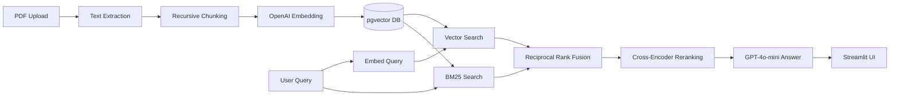

# ⚖️ Legal RAG — UK Financial Compliance Engine

Enterprise-grade Retrieval-Augmented Generation system for UK financial compliance documents.

## Architecture



## Features

| Feature | Description |
|---------|-------------|
| **Hybrid Search** | Vector (pgvector cosine) + BM25 (PostgreSQL tsvector) |
| **RRF Fusion** | Reciprocal Rank Fusion merges both result sets |
| **Cross-Encoder** | `ms-marco-MiniLM-L-6-v2` reranks top candidates |
| **RAGAS Evaluation** | Faithfulness + Answer Relevancy on 50-question golden dataset |
| **CI/CD Gate** | Fails builds if quality scores drop below 0.85 |
| **Source Transparency** | Shows exact retrieved chunks with provenance metadata |

## Quick Start

### 1. Set Up Database

Create a serverless PostgreSQL database on [Neon.tech](https://neon.tech) with pgvector enabled:

```sql
CREATE EXTENSION IF NOT EXISTS vector;
```

### 2. Configure Environment

**On Hugging Face Spaces** — set these as Space Secrets:
- `DB_URL` — PostgreSQL connection string
- `OPENAI_API_KEY` — OpenAI API key
- `HF_TOKEN` — Hugging Face token

**For local development** — create `.env`:
```bash
cp .env.example .env
# Edit .env with your credentials
```

### 3. Install Dependencies

```bash
pip install -r requirements.txt
```

### 4. Run Locally

```bash
streamlit run app.py
```

### 5. Run Evaluation

```bash
python -m evaluation.evaluate_pipeline
python ci/quality_gate.py
```

## Tech Stack

- **Embeddings**: OpenAI `text-embedding-3-small` (1536 dimensions)
- **LLM**: GPT-4o-mini
- **Vector DB**: PostgreSQL + pgvector (Neon.tech)
- **Keyword Search**: PostgreSQL native tsvector/tsquery
- **Reranker**: `cross-encoder/ms-marco-MiniLM-L-6-v2`
- **Evaluation**: RAGAS (Faithfulness + Answer Relevancy)
- **UI**: Streamlit (hosted on Hugging Face Spaces)
- **CI/CD**: GitHub Actions with quality gating

## License

MIT
